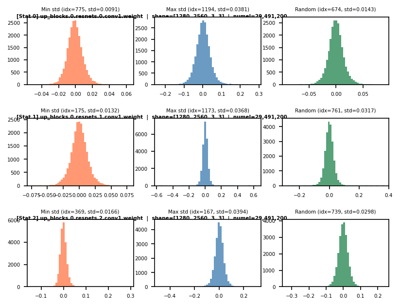

# Efficient-Diffusion

Light weight toolkit and experiment playground for efficient diffusion 

## Quick Start

```bash
pip install -r requirements.txt
```

## Walkthrough of DDPM and FM
```python 
# Training and sample a DDPM using MNIST dataset
python scripts\mnist_train_ddpm.py
```

```python 
# Training and sample a FM using MNIST dataset
python scripts\mnist_train_fm.py
```

## Unified Training & Sampling for FP/Quantized using DDPM/FM/CM on Various Benchmark
```python 
# Training a Quantized Simple DiT on MNIST dataset using Flow Matching
python main.py `
    --model_name=quantized_dit `
    --model_config_path=config/mnist_dit_fm/model.yaml `
    --dataset_name=MNIST `
    --dataset_config_path=config/mnist_dit_fm/dataset.yaml `
    --running_config_path=config/mnist_dit_fm/running.yaml `
    --output_dir=Results/mnist_quantized_dit_fm
```

## Pre Study

### Visualization
```python
python scripts\quant_visualization.py
```

### Runtime under Optimization (SD v1.5 / CPU / float32 / 5 Trials / Anaomly Removed)

```python
python scripts\measurement_mse_runtime.py
```

| 方案 | 步数 | 耗时均值 | 耗时 std | 耗时范围 | 加速比 | MSE 均值 | MSE std |
|------|------|---------|---------|----------|--------|---------|---------|
| baseline | 25 | 138.0s | 4.8s | [132s, 144s] | 1.0× | — | — |
| torchao INT8 量化 | 25 | 155.0s | 9.8s | [144s, 166s] | 0.9× | 19.7 | 17.0 |
| DDIM | 10 | 61.0s | 4.6s | [56s, 67s] | 2.3× | 1607.6 | 487.0 |

- **DDIM** 稳定加速 2.3×（步数从 25 → 10），但 MSE 较高（采样路径差异）
- **torchao INT8 量化** 精度几乎无损 (MSE=19.7)，但 CPU 上反量化有额外开销，无加速效果
- **baseline** 第 5 轮出现异常高耗时 (1881.853s)，已从统计中排除（可能由 CPU 降频/后台干扰导致）

#### Alpha Scaning (SD v1.5 / CPU / seed=42 / 25 steps)

```
python python scripts/quant_comparison.py
```

逐步降低 alpha 以增强量化强度，观察质量退化趋势。alpha=1.0 等价于默认量化，alpha 越低量化越激进（裁剪离群值越多）。

##### INT8 Quantization

| alpha | MSE | SSIM | 质量判断 |
|-------|-----|------|----------|
| 1.00 | — | — | baseline（无量化） |
| 0.90 | 9.2 | 0.9874 | 几乎无损 |
| 0.80 | 26.7 | 0.9654 | 轻微退化 |
| **0.70** | **62.0** | **0.9273** | **明显退化，临界点** |

> **结论**: alpha=0.80 是 INT8 的安全量化下限（SSIM > 0.96），alpha=0.70 时 MSE 飙升、SSIM 跌破 0.93。

##### INT4 Quantization

| alpha | MSE | SSIM | 质量判断 |
|-------|-----|------|----------|
| 1.00 | 1645.4 | 0.5412 | 严重退化 |
| 0.95 | 3093.2 | 0.4285 | 严重退化 |
| 0.90 | 1446.3 | 0.3783 | 严重退化 |
| 0.85 | 1611.5 | 0.3594 | 严重退化 |
| 0.80 | 2728.5 | 0.2966 | 严重退化 |
| 0.75 | 2463.3 | 0.2522 | 严重退化 |
| 0.70 | 3676.9 | 0.2017 | 严重退化 |

> **结论**: 简单 per-channel INT4（仅 15 个量化级别）对 SD v1.5 完全不可用，SSIM 全部 < 0.55，图像严重劣化。INT4 需要更精细的量化方案（如 group-wise quantization, GPTQ 等）。

> **注意**: torchao 的 `Int4WeightOnlyConfig` (version=2) 依赖 mslk CUDA kernel，CPU 上无法使用。


### Distribution of Model Parameters

以`runwayml/stable-diffusion-v1-5`为例，取参数量前3的模块，观察按`dim=0`做group slicing, 观察方差最大最小以及随机group的histogram: 

```python
python scripts\arch_inspect.py
```
没有发现明显差异：



对全部参数，观察方差最大最小以及随机group的histogram: 

说明该模型各层参数的分布还是比较均匀，不需要做较多额外调整。

## DONE & TODO
- [x] Quantization on Toy Benchmark (MNIST x DiT x DDPM/FM)
- [] Quantization on Video Generation Methods
- [] Large scale experiments